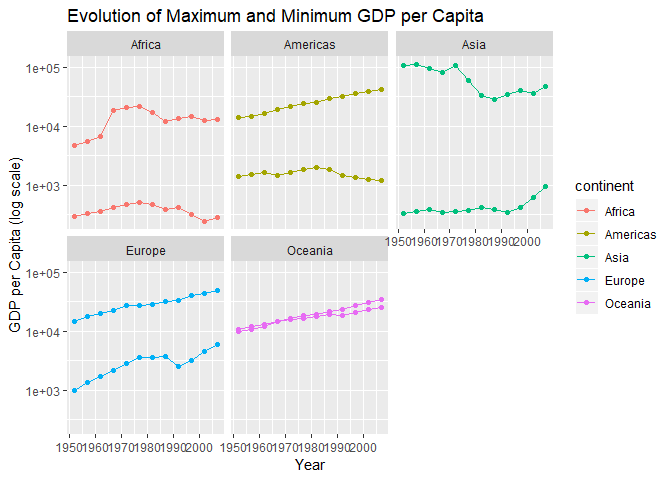
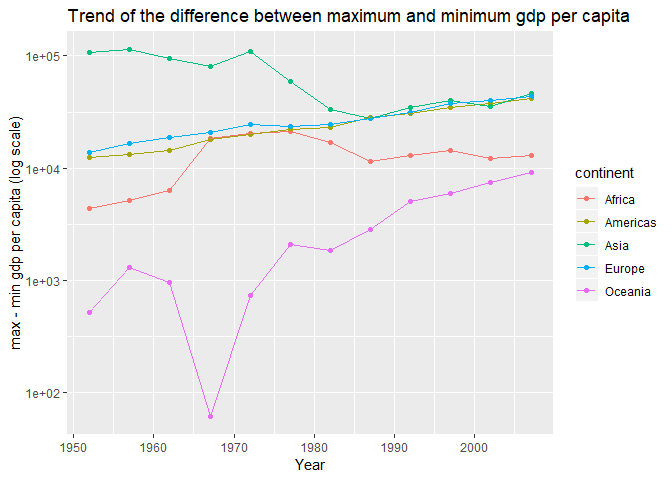
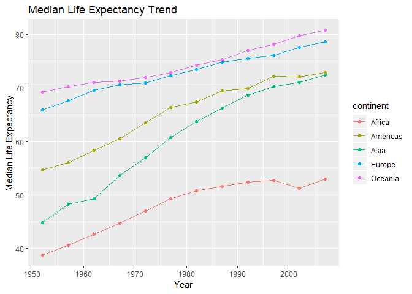
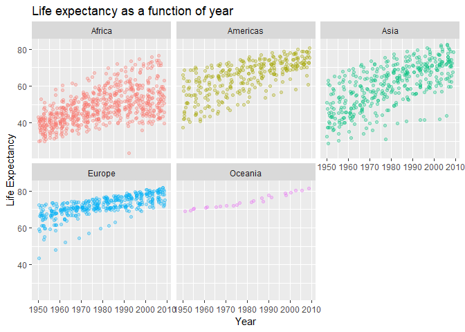
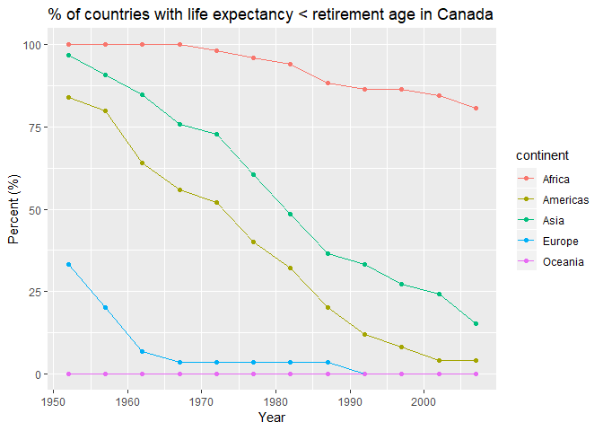

Homework 03: Use dplyr/ggplot2 to manipulate and explore data
================

-   [Bring rectangular data in](#bring-rectangular-data-in)
-   [Task Menu](#task-menu)
    -   [The maximum and minimum of GDP per capita for all continents.](#the-maximum-and-minimum-of-gdp-per-capita-for-all-continents.)
    -   [The spread of GDP per capita within the continents](#the-spread-of-gdp-per-capita-within-the-continents)
    -   [How is life expectancy changing over time on different continents?](#how-is-life-expectancy-changing-over-time-on-different-continents)
    -   [Turkey: A country with an interesting story?](#turkey-a-country-with-an-interesting-story)
    -   [Countries with life expectancy less than the retirement age of Canada](#countries-with-life-expectancy-less-than-the-retirement-age-of-canada)

Bring rectangular data in
-------------------------

As usual, we load the gapminder data.frame and tidyverse to use dplyr and ggplot2.

``` r
suppressPackageStartupMessages(library(tidyverse))
suppressPackageStartupMessages(library(gapminder))
```

Task Menu
---------

In this section, I shall investigate a few different questions related to the gapminder data.frame, using `dplyr` as the main tool for data manipulation, and `ggplot2` as the main tool of visualisation.

#### The maximum and minimum of GDP per capita for all continents.

Let's analyse how the maximum and minimum of GDP per capita for all continents compare with each other.

``` r
#create dataframe `gdpmdr` which selects year, continent, gdpPercap from gapminder
#and groups by year, continent

gdpmdr <- gapminder %>% #load in gapminder
  select(year, continent, gdpPercap) %>% #select the relevant columns of interest
  group_by(year, continent) %>% 
  
  #within the group `continent`, compute min & max of gdpperCap
  summarise(min_gdpPercap = min(gdpPercap), max_gdpPercap = max(gdpPercap)) 

knitr::kable(gdpmdr) #produce table of year, min, max, of each continent
```

|  year| continent |  min\_gdpPercap|  max\_gdpPercap|
|-----:|:----------|---------------:|---------------:|
|  1952| Africa    |        298.8462|        4725.296|
|  1952| Americas  |       1397.7171|       13990.482|
|  1952| Asia      |        331.0000|      108382.353|
|  1952| Europe    |        973.5332|       14734.233|
|  1952| Oceania   |      10039.5956|       10556.576|
|  1957| Africa    |        335.9971|        5487.104|
|  1957| Americas  |       1544.4030|       14847.127|
|  1957| Asia      |        350.0000|      113523.133|
|  1957| Europe    |       1353.9892|       17909.490|
|  1957| Oceania   |      10949.6496|       12247.395|
|  1962| Africa    |        355.2032|        6757.031|
|  1962| Americas  |       1662.1374|       16173.146|
|  1962| Asia      |        388.0000|       95458.112|
|  1962| Europe    |       1709.6837|       20431.093|
|  1962| Oceania   |      12217.2269|       13175.678|
|  1967| Africa    |        412.9775|       18772.752|
|  1967| Americas  |       1452.0577|       19530.366|
|  1967| Asia      |        349.0000|       80894.883|
|  1967| Europe    |       2172.3524|       22966.144|
|  1967| Oceania   |      14463.9189|       14526.125|
|  1972| Africa    |        464.0995|       21011.497|
|  1972| Americas  |       1654.4569|       21806.036|
|  1972| Asia      |        357.0000|      109347.867|
|  1972| Europe    |       2860.1698|       27195.113|
|  1972| Oceania   |      16046.0373|       16788.629|
|  1977| Africa    |        502.3197|       21951.212|
|  1977| Americas  |       1874.2989|       24072.632|
|  1977| Asia      |        371.0000|       59265.477|
|  1977| Europe    |       3528.4813|       26982.291|
|  1977| Oceania   |      16233.7177|       18334.198|
|  1982| Africa    |        462.2114|       17364.275|
|  1982| Americas  |       2011.1595|       25009.559|
|  1982| Asia      |        424.0000|       33693.175|
|  1982| Europe    |       3630.8807|       28397.715|
|  1982| Oceania   |      17632.4104|       19477.009|
|  1987| Africa    |        389.8762|       11864.408|
|  1987| Americas  |       1823.0160|       29884.350|
|  1987| Asia      |        385.0000|       28118.430|
|  1987| Europe    |       3738.9327|       31540.975|
|  1987| Oceania   |      19007.1913|       21888.889|
|  1992| Africa    |        410.8968|       13522.158|
|  1992| Americas  |       1456.3095|       32003.932|
|  1992| Asia      |        347.0000|       34932.920|
|  1992| Europe    |       2497.4379|       33965.661|
|  1992| Oceania   |      18363.3249|       23424.767|
|  1997| Africa    |        312.1884|       14722.842|
|  1997| Americas  |       1341.7269|       35767.433|
|  1997| Asia      |        415.0000|       40300.620|
|  1997| Europe    |       3193.0546|       41283.164|
|  1997| Oceania   |      21050.4138|       26997.937|
|  2002| Africa    |        241.1659|       12521.714|
|  2002| Americas  |       1270.3649|       39097.100|
|  2002| Asia      |        611.0000|       36023.105|
|  2002| Europe    |       4604.2117|       44683.975|
|  2002| Oceania   |      23189.8014|       30687.755|
|  2007| Africa    |        277.5519|       13206.485|
|  2007| Americas  |       1201.6372|       42951.653|
|  2007| Asia      |        944.0000|       47306.990|
|  2007| Europe    |       5937.0295|       49357.190|
|  2007| Oceania   |      25185.0091|       34435.367|

The table produced is not particularly helpful, say, if we are looking for trends, and is much too big. Preferably, let's make a plot using the data.

``` r
ggplot(gdpmdr, aes(colour = continent)) + #colour by continent 
  scale_y_log10()+ #log scale for gdpPercap
  
  geom_point(aes(year, min_gdpPercap)) + #scatterplot for min's
  geom_point(aes(year, max_gdpPercap)) + #scatterplot for max's
  
  geom_line(aes(year, min_gdpPercap)) + #join min points with a line
  geom_line(aes(year, max_gdpPercap)) + #join max points with a line
  
  facet_wrap(~continent) + #produce plots according to continent

  #title and axis labels
  ggtitle("Evolution of Maximum and Minimum GDP per Capita") +
  xlab("Year")+ 
  ylab("GDP per Capita (log scale)") 
```



The graph shows a substantial variation between maximum and minimum gdp per capita (with exception of Oceania, but this only has two countries). The difference between max and min does not seem to have really changed as time has progressed. To analyse this further let's make a plot to see exactly what the trend is. Due to the number of rows, we will not print out a table.

``` r
gdpmdr %>% #load data frame   gdpmdr created before
  
  mutate(max_min_gdpPercap_diff = max_gdpPercap - min_gdpPercap) %>% #add column computing max minus min
  select(year, continent, max_min_gdpPercap_diff) %>% #select only relevant columns

  #make a scatterplot & line plot of max_min_gdpPercap_diff and year, 
  #coloured by continent, and with log scale on y-axis
  ggplot(aes(year, max_min_gdpPercap_diff, colour = continent)) +
  geom_point() +
  geom_line() +
  scale_y_log10() +
  
  #add title and axis labels
  ggtitle("Trend of the difference between maximum and minimum gdp per capita") +  
  xlab("Year")+ 
  ylab("max - min gdp per capita (log scale)") 
```



It is an interesting trend that the difference in GDP per capita between the richest country (i.e. the country with highest GDP per capita) and poorest country (the country with lowest GDP per capita) within each continent, seems to be increasing.

#### The spread of GDP per capita within the continents

A final task for GDP per capita will be to look at the spread of GDP per capita within each continent.

``` r
gapminder %>% 
  filter(year == 2007) %>% #filter gapminder to year 2007
  mutate(gdp = pop*gdpPercap) %>% #add column computing GDP
  

  #make dot plots of gdpPercap, with log scaling 
  ggplot( aes(gdp)) +
  geom_dotplot() +
  scale_x_log10() +
  facet_wrap(~continent) +
  
  #add title
  ggtitle("GDP Spread of Countries in 2007") 
```

    ## `stat_bindot()` using `bins = 30`. Pick better value with `binwidth`.


#### How is life expectancy changing over time on different continents?

To answer this question, we compute, in each year, the median life expectancy for each continent, and make a scatter plot of the resulting data.

``` r
#Compute the median life expectancy for each continent in each year and store it in a new data.frame `md`
md <- gapminder %>% 
  
  select(continent, year, lifeExp) %>% #choose relevant data from gapminder
  
  group_by(year, continent) %>% #group by year, then continent
  
  #within the `continent` grouping, compute the median life expectancy among all countries for a given year
  summarise(median_lifeExp = median(lifeExp)) 

knitr::kable(md) #produce table of the resulting data
```

|  year| continent |  median\_lifeExp|
|-----:|:----------|----------------:|
|  1952| Africa    |          38.8330|
|  1952| Americas  |          54.7450|
|  1952| Asia      |          44.8690|
|  1952| Europe    |          65.9000|
|  1952| Oceania   |          69.2550|
|  1957| Africa    |          40.5925|
|  1957| Americas  |          56.0740|
|  1957| Asia      |          48.2840|
|  1957| Europe    |          67.6500|
|  1957| Oceania   |          70.2950|
|  1962| Africa    |          42.6305|
|  1962| Americas  |          58.2990|
|  1962| Asia      |          49.3250|
|  1962| Europe    |          69.5250|
|  1962| Oceania   |          71.0850|
|  1967| Africa    |          44.6985|
|  1967| Americas  |          60.5230|
|  1967| Asia      |          53.6550|
|  1967| Europe    |          70.6100|
|  1967| Oceania   |          71.3100|
|  1972| Africa    |          47.0315|
|  1972| Americas  |          63.4410|
|  1972| Asia      |          56.9500|
|  1972| Europe    |          70.8850|
|  1972| Oceania   |          71.9100|
|  1977| Africa    |          49.2725|
|  1977| Americas  |          66.3530|
|  1977| Asia      |          60.7650|
|  1977| Europe    |          72.3350|
|  1977| Oceania   |          72.8550|
|  1982| Africa    |          50.7560|
|  1982| Americas  |          67.4050|
|  1982| Asia      |          63.7390|
|  1982| Europe    |          73.4900|
|  1982| Oceania   |          74.2900|
|  1987| Africa    |          51.6395|
|  1987| Americas  |          69.4980|
|  1987| Asia      |          66.2950|
|  1987| Europe    |          74.8150|
|  1987| Oceania   |          75.3200|
|  1992| Africa    |          52.4290|
|  1992| Americas  |          69.8620|
|  1992| Asia      |          68.6900|
|  1992| Europe    |          75.4510|
|  1992| Oceania   |          76.9450|
|  1997| Africa    |          52.7590|
|  1997| Americas  |          72.1460|
|  1997| Asia      |          70.2650|
|  1997| Europe    |          76.1160|
|  1997| Oceania   |          78.1900|
|  2002| Africa    |          51.2355|
|  2002| Americas  |          72.0470|
|  2002| Asia      |          71.0280|
|  2002| Europe    |          77.5365|
|  2002| Oceania   |          79.7400|
|  2007| Africa    |          52.9265|
|  2007| Americas  |          72.8990|
|  2007| Asia      |          72.3960|
|  2007| Europe    |          78.6085|
|  2007| Oceania   |          80.7195|

Again, the table is too big to extract any meaningful information from it. Instead, let's visualise how the median life expectancy of each continent evolves in time, using a scatterplot.

``` r
#plot median life expectancy of each continent as a function of year, coloured by continent
ggplot(md, aes(year, median_lifeExp, colour = continent)) + 
  
  geom_point() +
  geom_line() +
  
  #add title, axis labels
  ggtitle("Median Life Expectancy Trend") + #main title 
  xlab("Year")+ #x axis label 
  ylab("Median Life Expectancy") #y axis label
```



As time progresses there ends up being a slight "clustering" of life expectancy with Europe and Oceania, Asia and the Americas, and then Africa with the lowest. It is reassuring that in all continents, the median life expectancy is increasing!

The median is really a "smoothing" of the data, and we aren't able to see the variation in life expectancy across each continent. For instance, there could be a wide variation in life expectancy among countries in Europe. Let's make a visualisation of the variation of life expectancy within each continent.

``` r
#create a jitter plot for each continent of life expectancy of each country in that continent versus time
gapminder %>% 
  select(continent, year, lifeExp) %>% 
  
  ggplot(aes(year, lifeExp)) +
  geom_jitter(aes(colour = continent), alpha = 0.3)+
  facet_wrap(~continent) +
  
  #remove legend (not useful here)
  theme(legend.position = "none")  + 
  
  
  #add title, axis labels
  ggtitle("Life expectancy as a function of year") + 
  xlab("Year")+ 
  ylab("Life Expectancy") 
```



There is a significant variation of life expectancy within Africa, Asia, and the Americas.

#### Turkey: A country with an interesting story?

Taking a look at the life expectancy graph of Europe displayed above, we see that there seems to be a country with a life expectancy which was the lowest among all European countries in 1952, but which substantially increased its life expectancy by 2010. What country was this? Is there anything interesting which we can investigate to explain this?

First let's determine what country in Europe this data corresponds to.

``` r
gapminder %>% #load gapminder
  filter(continent == "Europe", year == 1952) %>% #filter to Europe in 1952
  filter(lifeExp == min(lifeExp)) %>% #filter to minimum life expectancy
knitr::kable() #print out table
```

| country | continent |  year|  lifeExp|       pop|  gdpPercap|
|:--------|:----------|-----:|--------:|---------:|----------:|
| Turkey  | Europe    |  1952|   43.585|  22235677|   1969.101|

This country turns out to be Turkey. Perhaps it can be interesting to compare Turkey's GDP, population, and life expectancy on the same scale. Let's compute the following: Relative to each respective maximum, compute the relative population, relative GDP, and relative life expectancy. Then plot them on the same graph.

``` r
gapminder %>% 
  filter(country == "Turkey") %>% #filter gapminder to Turkey 
  mutate(gdp = pop*gdpPercap) %>% #add extra column computing GDP
  
  #add extra columns computing relative quantities (as described above)
  mutate(rel_lifeExp = lifeExp/max(lifeExp), rel_pop = pop/max(pop), rel_gdp = gdp/max(gdp)) %>% 
  
  
  #make plot
  ggplot() +
  
  #plots points, coloured according to GDP, life expectancy, population
  geom_point(aes(year, rel_lifeExp, colour = "rel_lifeExp")) +
  geom_point(aes(year, rel_pop, colour = "rel_pop")) +
  geom_point(aes(year, rel_gdp, colour = "rel_gdp")) +
  
  #add smooth interpolation of data
  geom_smooth(aes(year, rel_lifeExp, colour = "rel_lifeExp")) +
  geom_smooth(aes(year, rel_pop, colour = "rel_pop")) +
  geom_smooth(aes(year, rel_gdp , colour = "rel_gdp")) +
  
  
  #add titles and axis labels
  ggtitle("Relative growth as measured from maximum ") +
  xlab("Year")+ 
  ylab("Percent (%) of 2007 level") 
```

    ## `geom_smooth()` using method = 'loess' and formula 'y ~ x'
    ## `geom_smooth()` using method = 'loess' and formula 'y ~ x'
    ## `geom_smooth()` using method = 'loess' and formula 'y ~ x'


Based on the plot above, perhaps a naive explanation for the significant increase in life expectancy could be that the GDP of Turkey was increasing at a faster rate than its population, hence becoming wealthier!

#### Countries with life expectancy less than the retirement age of Canada

In this question we shall analyse how many countries on each continent have a life expectancy less than some determined benchmark, for each year. We shall use as a (potentially interesting) benchmark for comparison, "retirement age in Canada". According to [StatsCan](https://www150.statcan.gc.ca/t1/tbl1/en/tv.action?pid=1410006001), the average retirement age in Canada in 2017 was 63.6 years.

``` r
r_age_canada <- 63.6 # store user-defined retirement age in Canada
```

Our question, is therefore,

-   **what is the relative abundance of countries within each continent with life expectancy less than the retirement age in Canada, for each year?**

``` r
#store the following as a new data frame `rel`
rel <- gapminder %>% 
  
  #select the relevant columns from gapminder
  select(continent, year, lifeExp) %>% 
  
  #add an additional logical column `lifeExp_low` which checks 
  #which rows where life expectancy < r_age_canada
  mutate(lifeExp_low = lifeExp < r_age_canada) %>% 
  
  #group the data by year and continent
  group_by(year, continent) %>% 
  
  
  #within the grouping by continent, compute the relative number of countries 
  #within that continent with life expectancy < r_age_canada.
  #Sum counts TRUE as 1 and FALSE as 0, so `sum(lifeExp_low)` is the total 
  #number of countries within a continent where life expectancy < r_age_canada
  #Finally n() is the number of observations in the current group 
  #(i.e. total number of countries in a continent)
  #Multiply by 100 to get percentage (%)
  summarise(rel_lifeExp_low = 100*sum(lifeExp_low)/n())

#print table
knitr::kable(rel)
```

|  year| continent |  rel\_lifeExp\_low|
|-----:|:----------|------------------:|
|  1952| Africa    |         100.000000|
|  1952| Americas  |          84.000000|
|  1952| Asia      |          96.969697|
|  1952| Europe    |          33.333333|
|  1952| Oceania   |           0.000000|
|  1957| Africa    |         100.000000|
|  1957| Americas  |          80.000000|
|  1957| Asia      |          90.909091|
|  1957| Europe    |          20.000000|
|  1957| Oceania   |           0.000000|
|  1962| Africa    |         100.000000|
|  1962| Americas  |          64.000000|
|  1962| Asia      |          84.848485|
|  1962| Europe    |           6.666667|
|  1962| Oceania   |           0.000000|
|  1967| Africa    |         100.000000|
|  1967| Americas  |          56.000000|
|  1967| Asia      |          75.757576|
|  1967| Europe    |           3.333333|
|  1967| Oceania   |           0.000000|
|  1972| Africa    |          98.076923|
|  1972| Americas  |          52.000000|
|  1972| Asia      |          72.727273|
|  1972| Europe    |           3.333333|
|  1972| Oceania   |           0.000000|
|  1977| Africa    |          96.153846|
|  1977| Americas  |          40.000000|
|  1977| Asia      |          60.606061|
|  1977| Europe    |           3.333333|
|  1977| Oceania   |           0.000000|
|  1982| Africa    |          94.230769|
|  1982| Americas  |          32.000000|
|  1982| Asia      |          48.484848|
|  1982| Europe    |           3.333333|
|  1982| Oceania   |           0.000000|
|  1987| Africa    |          88.461539|
|  1987| Americas  |          20.000000|
|  1987| Asia      |          36.363636|
|  1987| Europe    |           3.333333|
|  1987| Oceania   |           0.000000|
|  1992| Africa    |          86.538461|
|  1992| Americas  |          12.000000|
|  1992| Asia      |          33.333333|
|  1992| Europe    |           0.000000|
|  1992| Oceania   |           0.000000|
|  1997| Africa    |          86.538461|
|  1997| Americas  |           8.000000|
|  1997| Asia      |          27.272727|
|  1997| Europe    |           0.000000|
|  1997| Oceania   |           0.000000|
|  2002| Africa    |          84.615385|
|  2002| Americas  |           4.000000|
|  2002| Asia      |          24.242424|
|  2002| Europe    |           0.000000|
|  2002| Oceania   |           0.000000|
|  2007| Africa    |          80.769231|
|  2007| Americas  |           4.000000|
|  2007| Asia      |          15.151515|
|  2007| Europe    |           0.000000|
|  2007| Oceania   |           0.000000|

``` r
#pipe in data frame `rel` created above
rel %>% 
  #plot year versus relative life expectancy, coloured by continent
  ggplot(aes(year, rel_lifeExp_low, colour = continent)) + 
  
  geom_point() + #add data points
  geom_line()+ #add line connecting the data
  
  #title, axis labels
  ggtitle("% of countries with life expectancy < retirement age in Canada") + 
  xlab("Year")+ 
  ylab("Percent (%)")
```



More than 75% of countries in Africa had a life expectancy in 2007 less than the retirement age in Canada!
