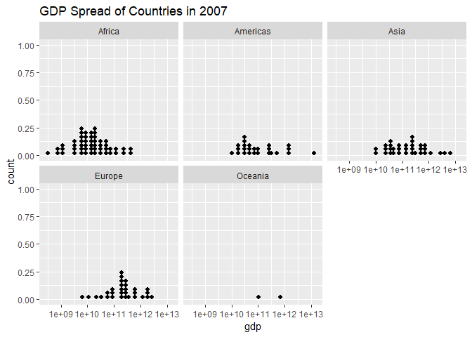

Homework 03: Use dplyr/ggplot2 to manipulate and explore data
================

-   [Bring rectangular data in](#bring-rectangular-data-in)
-   [Task Menu](#task-menu)
    -   [The maximum and minimum of GDP per capita for all continents.](#the-maximum-and-minimum-of-gdp-per-capita-for-all-continents.)
    -   [How is life expectancy changing over time on different continents?](#how-is-life-expectancy-changing-over-time-on-different-continents)
    -   [Q2: A country with an interesting story?](#q2-a-country-with-an-interesting-story)
    -   [Countries with life expectancy less than the retirement age of Canada](#countries-with-life-expectancy-less-than-the-retirement-age-of-canada)

Bring rectangular data in
-------------------------

As usual, we load the gapminder data.frame and tidyverse to use dplyr and ggplot2.

``` r
suppressPackageStartupMessages(library(tidyverse))
suppressPackageStartupMessages(library(gapminder))
```

Task Menu
---------

In this section, I shall investigate a few different questions related to the gapminder data.frame, using `dplyr` as the main tool for data manipulation, and `ggplot2` as the main tool of visualisation.

#### The maximum and minimum of GDP per capita for all continents.

Let's analyse how the maximum and minimum of GDP per capita for all continents compares to each other.

``` r
gpmdr <- gapminder %>% 
  select(year, continent, gdpPercap) %>% 
  group_by(year, continent) %>% 
  summarise(min = min(gdpPercap), max = max(gdpPercap))
gpmdr
```

    ## # A tibble: 60 x 4
    ## # Groups:   year [?]
    ##     year continent    min     max
    ##    <int> <fct>      <dbl>   <dbl>
    ##  1  1952 Africa      299.   4725.
    ##  2  1952 Americas   1398.  13990.
    ##  3  1952 Asia        331  108382.
    ##  4  1952 Europe      974.  14734.
    ##  5  1952 Oceania   10040.  10557.
    ##  6  1957 Africa      336.   5487.
    ##  7  1957 Americas   1544.  14847.
    ##  8  1957 Asia        350  113523.
    ##  9  1957 Europe     1354.  17909.
    ## 10  1957 Oceania   10950.  12247.
    ## # ... with 50 more rows

``` r
ggplot(gpmdr, aes(year, min, colour = continent)) + 
  scale_y_log10()+
  geom_point()
```


``` r
par(new = TRUE)
```

    ## Warning in par(new = TRUE): calling par(new=TRUE) with no plot

``` r
ggplot(gpmdr, aes(year, max, colour = continent)) + 
  scale_y_log10()+
  geom_point()
```


#### How is life expectancy changing over time on different continents?

One possible analysis could be to find, in each year, the median life expectancy for each continent, and make a scatter plot of the median life expectancy of each continent as a function of time.

The first thing we do is select `continent`, `year`, and `lifeExp`, from the gapminder data.frame, and compute in each year, the median life expectancy for each continent.

``` r
#Compute the median life expectancy for each continent in each year and store it in a new data.frame `md`
md <- gapminder %>% 
  #choose the relevant data from gapminder
  select(continent, year, lifeExp) %>% 
  #we want to calculate the median life expectancy in a given year, among all countries in an given continent
  group_by(year, continent) %>% 
  #within the continent grouping, compute the median life expectancy among all countries for a given year
  summarise(median_lifeExp = median(lifeExp)) 

#knitr::kable(md)
```

The data.frame `md` is too big to display a full table with all five continents. Let's display the data for one continent, Africa, in a table.

``` r
#create new data.frame from `md` consisting for only the continent Africa, and create a table
md_africa <- filter(md, continent == "Africa")
knitr::kable(md_africa) 
```

|  year| continent |  median\_lifeExp|
|-----:|:----------|----------------:|
|  1952| Africa    |          38.8330|
|  1957| Africa    |          40.5925|
|  1962| Africa    |          42.6305|
|  1967| Africa    |          44.6985|
|  1972| Africa    |          47.0315|
|  1977| Africa    |          49.2725|
|  1982| Africa    |          50.7560|
|  1987| Africa    |          51.6395|
|  1992| Africa    |          52.4290|
|  1997| Africa    |          52.7590|
|  2002| Africa    |          51.2355|
|  2007| Africa    |          52.9265|

``` r
#knitr::kable(md_europe)
```

And I want to change the name of median\_lifeExp to something more natural.

Now let's visualise how the median life expectancy of each continent evolves in time, by plotting on the same graph.

``` r
#plot median life expectancy of each continent as a function of year, coloured by continent
ggplot(md, aes(year, median_lifeExp, colour = continent)) + 
  geom_point() +
  geom_line()
```



It seems to be an interesting trend that as time progresses there ends up being a "clustering" of life expectancy with Europe and Oceania, Asia and the Americas, and then Africa with the lowest.

The median is really a "smoothing" of the data, and we aren't able to see the variation in life expectancy across each continent. For instance, there could be a wide variation in life expectancy among countries in Eurpoer. Let's make a visualisation of the variation of life expectancy within each continent.

``` r
#create a jitter plot for each continent of life expectancy of each country in that continent versus time
gapminder %>% 
  select(continent, year, lifeExp) %>% 
  ggplot(aes(year, lifeExp)) +
  geom_jitter(aes(colour = continent, alpha = 0.6))+
  facet_wrap(~continent) +
  theme(legend.position = "none")  + 
  ggtitle("Life expectancy as a function of year") + # for the main title 
  xlab("Year")+ # for the x axis label 
  ylab("Life Expectancy") # for the y axis label
```


``` r
  #geom_smooth(method = "lm")
```

#### Q2: A country with an interesting story?

Taking a look at the life expectancy graph of Europe displayed above, we see that there seems to be a country with a life expectancy which was the lowest among all European countries in 1952, but which substantially increased its life expectancy by 2010. What country was this? How does it's increase in life expectancy compare to the median of life expectancy across all the remaining European countries?

First let's determine what country in Europe this data corresponds to.

``` r
gapminder %>% 
  filter(continent == "Europe", year == 1952) %>% 
  filter(lifeExp == min(lifeExp)) %>% 
knitr::kable()
```

| country | continent |  year|  lifeExp|       pop|  gdpPercap|
|:--------|:----------|-----:|--------:|---------:|----------:|
| Turkey  | Europe    |  1952|   43.585|  22235677|   1969.101|

This country turns out to be Turkey.

#### Countries with life expectancy less than the retirement age of Canada

In this question we shall analyse how many countries on each continent have a life expectancy less than some determined benchmark, for each year. We shall use as a (potentially interesting) benchmark for comparison, "retirement age in Canada". According to [StatsCan](https://www150.statcan.gc.ca/t1/tbl1/en/tv.action?pid=1410006001), the average retirement age in Canada in 2017 was 63.6 years.

``` r
r_age_canada <- 63.6 # store user-defined retirement age in Canada
```

Our question, is therefore,

-   **what is the relative abundance of countries within each continent with life expectancy less than the retirement age in Canada, for each year?**

``` r
abs <- gapminder %>% 
  #select the relevant columns from gapminder
  select(continent, year, lifeExp) %>% 
  
  #add an additional logical column `lifeExp_low` which checks if the life expectancy 
  #corresponding to a particular country and year is below r_age_canada
  mutate(lifeExp_low = lifeExp < r_age_canada) %>% 
  
  #group the data by year and continent
  group_by(year, continent) %>% 
  
  #within the grouping by continent, compute the relative number of countries 
  #with that continent which have life expectancy below r_age_canada.
  #Note that sum counts TRUE as 1 and FALSE as 0, so `sum(lifeExp_low)` is the total 
  #number of countries within a continent which have life expectancy below r_age_canada
  #Finally n() is the number of observations in the current group (i.e. continent) (discussed below), 
  #so sum(lifeExp_low)/n() is the relative abundance of countries with life expectancy 
  #less than r_age_canada.
  summarise(rel_lifeExp_low = 100*sum(lifeExp_low)/n())
abs
```

    ## # A tibble: 60 x 3
    ## # Groups:   year [?]
    ##     year continent rel_lifeExp_low
    ##    <int> <fct>               <dbl>
    ##  1  1952 Africa              100  
    ##  2  1952 Americas             84  
    ##  3  1952 Asia                 97.0
    ##  4  1952 Europe               33.3
    ##  5  1952 Oceania               0  
    ##  6  1957 Africa              100  
    ##  7  1957 Americas             80  
    ##  8  1957 Asia                 90.9
    ##  9  1957 Europe               20  
    ## 10  1957 Oceania               0  
    ## # ... with 50 more rows

``` r
abs %>% 
  ggplot(aes(year, rel_lifeExp_low, colour = continent)) + #plot year versus relative life expectancy, coloured by continent
  geom_point() + #add data points
  geom_line()+ #add line connecting the data
  ggtitle("% of countries with life expectancy < retirement age in Canada") + # for the main title 
  xlab("Year")+ # for the x axis label 
  ylab("Percent (%)") # for the y axis label
```


``` r
#
#xlab(Year) # for the x axis label
#ylab("Percent of countries with low life expectancy") # for the y axis label
#labs(...) # for the main title, axis labels and legend titles
```
